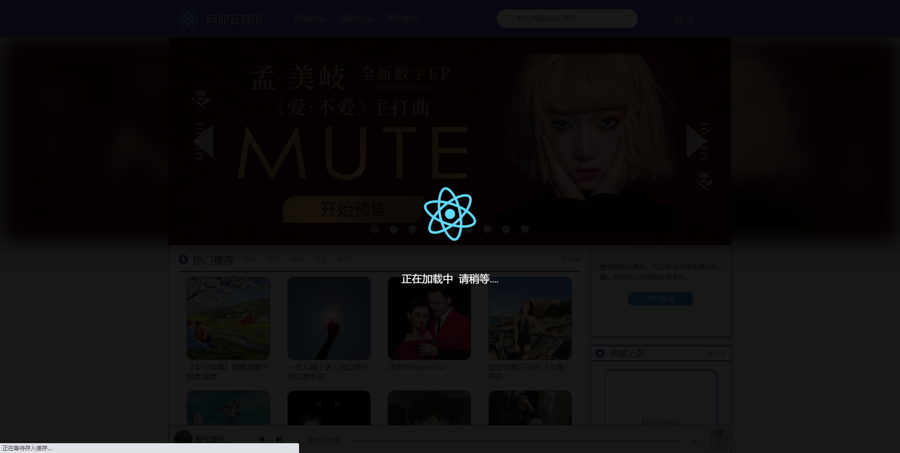
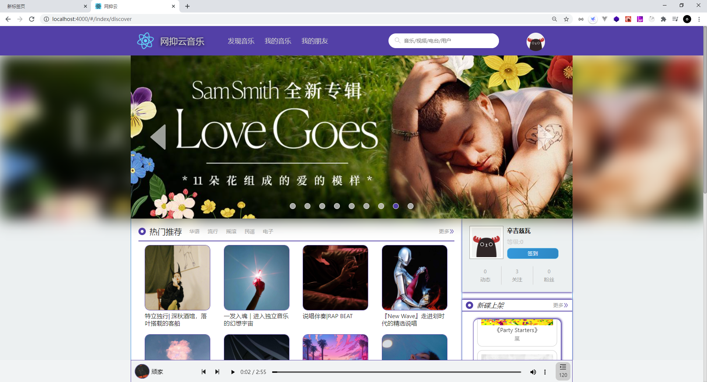
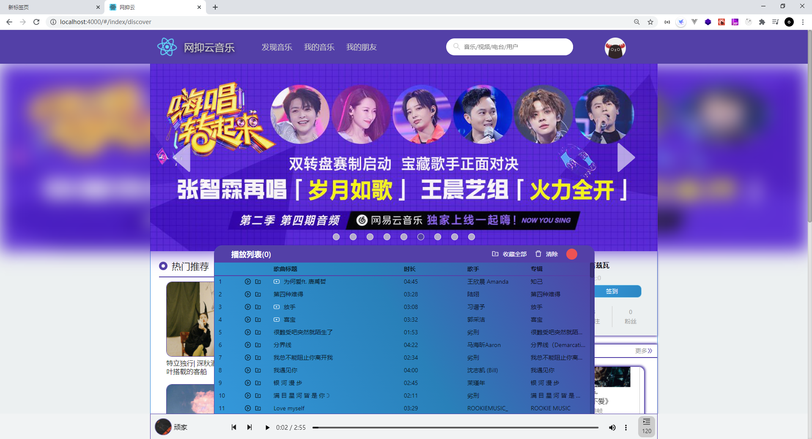
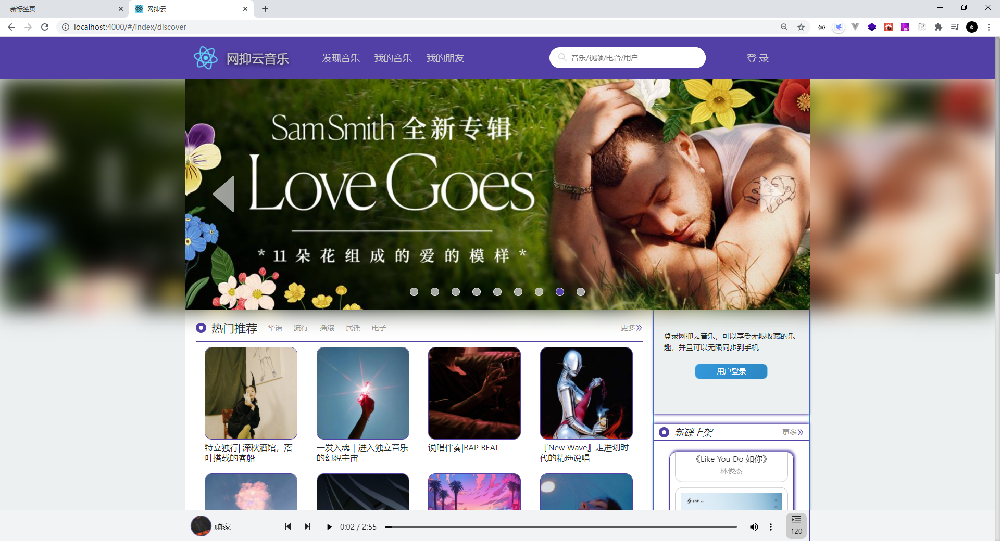
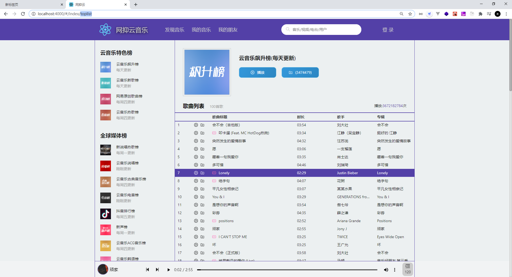
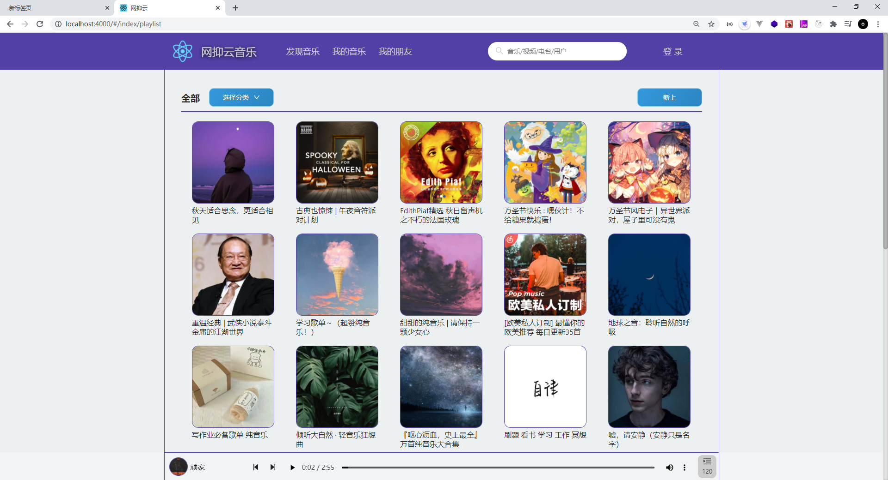
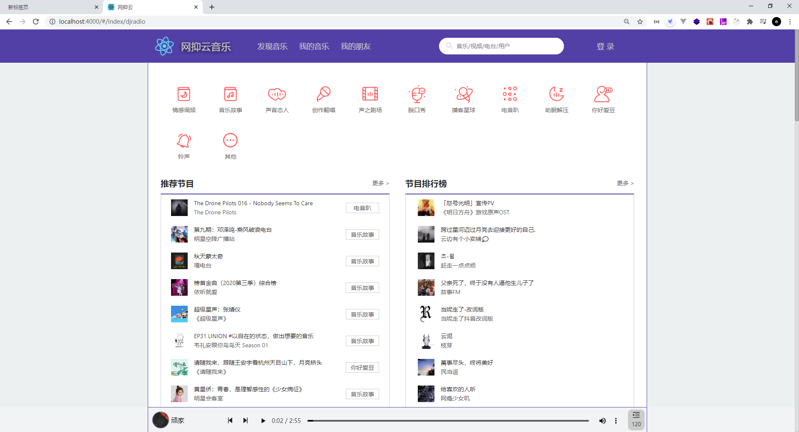
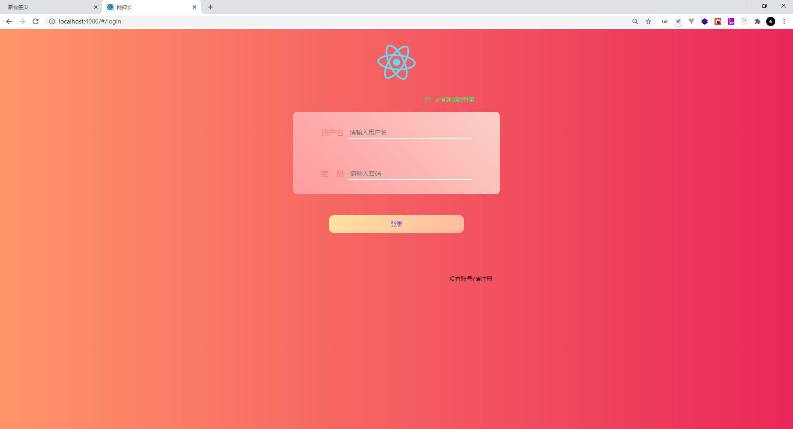

本项目使用react+react-router-dom + react-redux + antd模仿网易云音乐web端

  antd 使用了 Icon图标 Message提示 以及分页组件，
  大量动画均为自己所写。
  首页轮播滚动等也都是自己完成。
  音频播放兄弟组件传参使用events完成

本想尽量做全一点，因为时间就到此为止，作为一个练习项目而言，也是比较可以的了。

# 运行项目
  - 请先下载接口代码，地址在下方
  - 确保接口代码运行在3000端口
  - git clone 本项目
  - yarn
  - yarn start即可启动项目

感谢binaryify，----[接口地址](https://github.com/Binaryify/NeteaseCloudMusicApi)

# 展示
首屏加载动画页面

主页

排行榜

歌单

主播电台

登录页面

mv

整体gif展示

所用部分接口将会在下方展示。

# 使用接口

接口使用文档：[接口地址](https://neteasecloudmusicapi.vercel.app/#/)

大家可以复制名称到接口文档中查看详细接口说明

### banner

说明 : 调用此接口 , 可获取 banner( 轮播图 ) 数据

### 推荐歌单

说明 : 调用此接口 , 可获取推荐歌单

### 热门歌单分类

说明 : 调用此接口,可获取歌单分类,包含 category 信息

### 所有榜单页面

说明 : 调用此接口,可获取所有榜单 接口地址 : /toplist

### 排行榜详情

说明 : 调用此接口 , 传入榜单 id, 可获取不同排行榜数据
也可使用歌单详情接口,传入排行榜id获取排行榜详情数据(排行榜也是歌单的一种)

### 新碟上架

说明 : 调用此接口 ,可获取数字专辑-新碟上架

### 获取专辑内容

说明 : 调用此接口 , 传入专辑 id, 可获得专辑内容

### 获取歌单详情

说明 : 歌单能看到歌单名字, 但看不到具体歌单内容 , 调用此接口 , 传入歌单 id, 可 以获取对应歌单内的所有的音乐(未登录状态只能获取不完整的歌单,登录后是完整的)，但是返回的trackIds是完整的，tracks 则是不完整的，可拿全部 trackIds 请求一次 song/detail 接口获取所有歌曲的详情

### 音乐是否可用

说明: 调用此接口,传入歌曲 id, 可获取音乐是否可用,返回 { success: true, message: 'ok' } 或者 { success: false, message: '亲爱的,暂无版权' }

### 获取音乐 url

说明 : 使用歌单详情接口后 , 能得到的音乐的 id, 但不能得到的音乐 url, 调用此接口, 传入的音乐 id( 可多个 , 用逗号隔开 ), 可以获取对应的音乐的 url,未登录状态返回试听片段(返回字段包含被截取的正常歌曲的开始时间和结束时间)

### 登录

说明 : 登录有两个接口,一个手机号登录一个邮箱登录。具体请看文档

